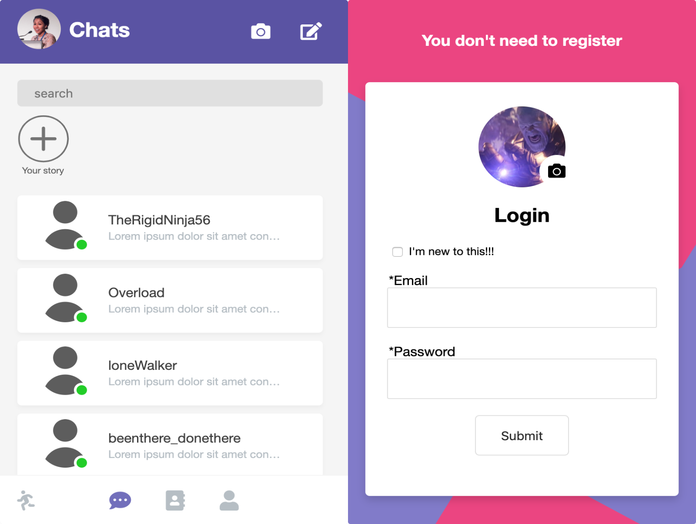

## Chat App

You can test this app <a href="https://chatappe.herokuapp.com/">[ here ]</a> --> <i>Be patient until Heroku warms up</i>

To run it locally use the following commands to npm install all dependencies

<code>npm i express socket.io http path livereload firebase firebase-admin ejs mocha chai</code>

<i>You will need your  own firebase config key</i>

### Current Interface So far

## Process to deploy on heroku
<code>heroku login </code>
<code>heroku git:remote -a chatappe</code>
<code>$ git add .</code>
<code>$ git push heroku master</code>