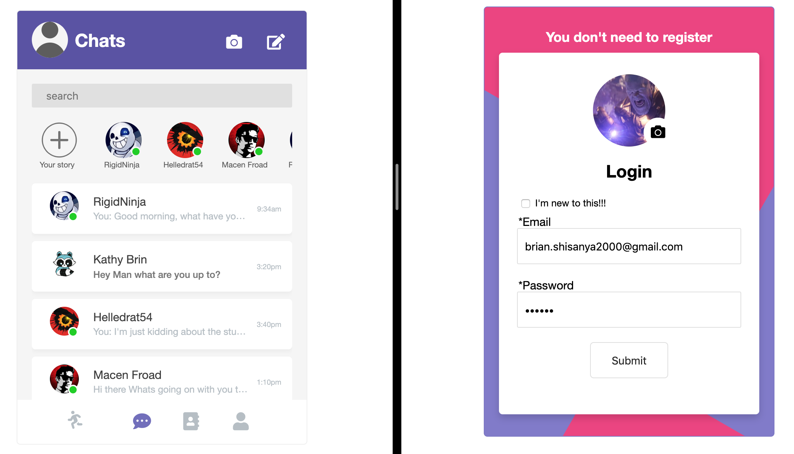

## Chat App

You can test this app <a href="https://chatappe.herokuapp.com/">[ here ]</a> --> <i>Be patient until Heroku warms up</i>

To run it locally use the following commands to npm install all dependencies

<code>npm i express socket.io http path livereload firebase firebase-admin ejs mocha chai</code>

<i>You will need your  own firebase config key</i>

### How it works

### How it looks like so far

### How to deploy to Heroku!
<code>heroku login </code> 
<code>heroku git:remote -a chatappe</code> 
<code>$ git add .</code> 
<code>$ git push heroku master</code> 

### OFfline Test / Make local port public
<code>lt --port 8080</code>
##OR
<code>cd ../../ && ./ngrok http 8080</code>